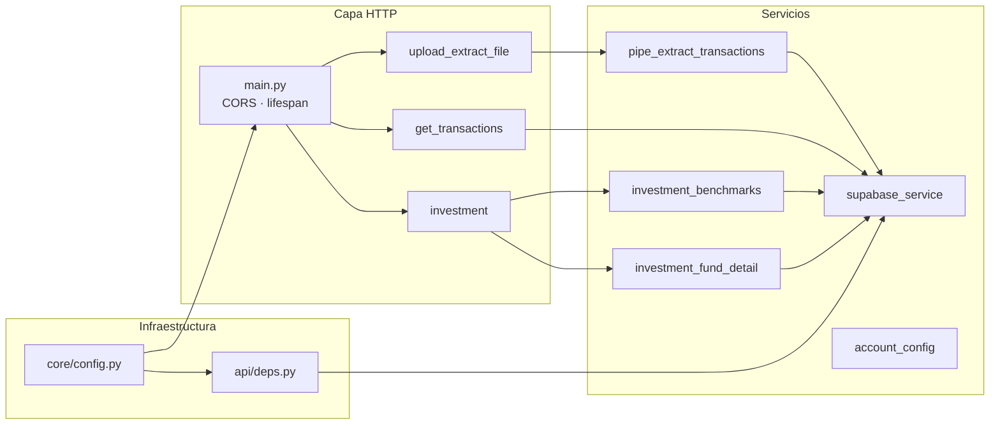
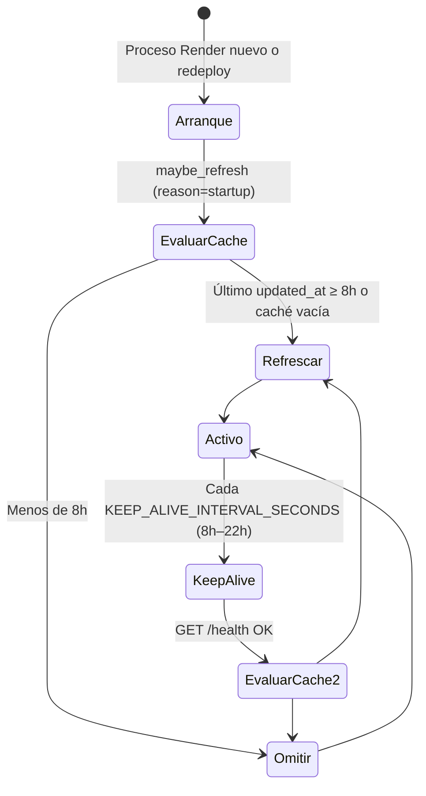
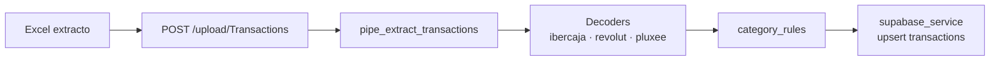

# Backend — FastAPI

API REST de BankaAppTracker. Autentica con JWT de Supabase, persiste en PostgreSQL y orquesta importación de extractos, consultas financieras e inversión (yfinance).

**Relacionado:** [README raíz](../README.md) · [Esquema Supabase](supabase/README.md) · [Frontend](../Frontend/README.md)

---

## Arquitectura en capas



### Árbol de código relevante

```text
Backend/
├── app/
│   ├── main.py                      # App FastAPI, lifespan, keep-alive
│   ├── core/config.py               # Variables de entorno (Pydantic)
│   ├── api/
│   │   ├── deps.py                  # get_current_user (JWT)
│   │   ├── routers/
│   │   │   ├── upload_extract_file.py
│   │   │   ├── get_transactions.py
│   │   │   └── investment.py
│   │   └── services/
│   │       ├── supabase/supabase_service.py
│   │       ├── pipe_extract_transactions/
│   │       ├── investment_benchmarks.py
│   │       └── investment_fund_detail.py
│   └── ...
├── scripts/
│   └── rebuild_investment_benchmark_series_cache.py
├── supabase/                        # SQL → ver supabase/README.md
├── requirements.txt
└── .env.example
```

---

## Catálogo de API

Prefijos montados en `main.py`: routers `upload` y `GET`.

| Método | Ruta | Auth | Descripción |
|--------|------|:----:|-------------|
| GET/HEAD | `/`, `/health` | No | Health / info |
| GET | `/test` | No* | Diagnóstico (*solo si `ENABLE_DIAGNOSTIC_ENDPOINT=true`) |
| **Upload** |
| POST | `/upload/Transactions` | Sí | Subir Excel extracto (Ibercaja, Revolut, Pluxee, …) |
| **Transacciones y cuentas** |
| GET | `/GET/category-catalog` | Sí | Catálogo categorías |
| GET | `/GET/balances` | Sí | Saldo por cuenta |
| GET | `/GET/transactions` | Sí | Transacciones (filtro fechas) |
| GET | `/GET/shared-transactions` | Sí | Transacciones cuentas compartidas |
| PATCH | `/GET/shared-consent` | Sí | Consentimiento gastos compartidos |
| GET | `/GET/accounts` | Sí | Cuentas del usuario |
| PATCH | `/GET/accounts/{account_id}` | Sí | Renombrar cuenta |
| PATCH | `/GET/transactions/{row_id}` | Sí | Editar movimiento |
| PATCH | `/GET/transactions/{row_id}/category` | Sí | Categoría / subcategoría |
| DELETE | `/GET/transactions/{row_id}` | Sí | Borrar movimiento |
| POST | `/GET/transactions/batch-delete` | Sí | Borrado en lote |
| POST | `/GET/transactions/batch-category` | Sí | Categoría en lote |
| **Hipoteca** |
| GET | `/GET/mortgage` | Sí | Config + recibos |
| PATCH | `/GET/mortgage/settings` | Sí | Guardar parámetros hipoteca |
| PATCH | `/GET/mortgage/receipts` | Sí | Estado recibo |
| **Inversión** |
| GET | `/GET/investment/benchmarks` | Sí | Series ~5y en caché (cliente filtra periodo) |
| GET | `/GET/investment/funds` | Sí | Watchlist ISIN |
| POST | `/GET/investment/funds` | Sí | Añadir ISIN (+ warm caché) |
| DELETE | `/GET/investment/funds/{isin}` | Sí | Quitar ISIN |
| GET | `/GET/investment/fund-detail` | Sí | Ficha Yahoo (`isin` o `symbol` cripto) |

Documentación interactiva en local: `http://localhost:8000/docs`

---

## Autenticación

```mermaid
sequenceDiagram
  participant C as Cliente Angular
  participant B as FastAPI deps
  participant S as Supabase Auth API

  C->>B: Authorization: Bearer &lt;jwt&gt;
  B->>S: auth.get_user(jwt)
  alt válido
    S-->>B: user.id
    B-->>C: Continúa al router
  else inválido
    B-->>C: 401
  end
```

Implementación: `app/api/deps.py` → `get_current_user`. El cliente Supabase del backend usa **service role** para operaciones de datos; la validación del JWT es independiente.

---

## Procesos en background

Definidos en `app/main.py` (lifespan).



| Proceso | Condición | Acción |
|---------|-----------|--------|
| Refresco benchmarks | `INVESTMENT_BENCHMARK_REFRESH_IN_APP=true` y Supabase conectado | `maybe_refresh_investment_benchmark_cache()` |
| Ventana 8 h | `now - max(updated_at)` en `investment_benchmark_series_cache` | Si ≥ `INVESTMENT_BENCHMARK_REFRESH_INTERVAL_HOURS` (default **8**) → `run_refresh_investment_benchmark_cache()` |
| Keep-alive | `APP_URL` o `RENDER_EXTERNAL_URL` definida | Ping periódico a `{APP_URL}/health` para reducir cold start (plan Free) |

Lógica detallada: `app/api/services/investment_benchmarks.py` (`should_refresh_*`, `maybe_refresh_*`).

### Refresco manual (desarrollo / ops)

```bash
cd Backend
venv\Scripts\python.exe scripts\rebuild_investment_benchmark_series_cache.py
venv\Scripts\python.exe scripts\rebuild_investment_benchmark_series_cache.py --full-rebuild
```

`--full-rebuild` vacía `investment_benchmark_series_cache` antes de descargar (ver SQL en `supabase/sql/maintenance/`).

---

## Variables de entorno

Archivo plantilla: `.env.example`. Carga: `app/core/config.py` (`Settings`).

| Variable | Obligatoria | Descripción |
|----------|:-----------:|-------------|
| `SUPABASE_URL` | Sí | URL del proyecto Supabase |
| `SUPABASE_ANON_KEY` | Sí* | Clave anon (*o `SUPABASE_KEY`) |
| `SUPABASE_SERVICE_ROLE_KEY` | Sí | Escritura backend y bypass RLS controlado |
| `CORS_ORIGINS` | Prod | CSV de orígenes (ej. Vercel + localhost) |
| `APP_URL` | Recomendada | URL pública del backend (keep-alive) |
| `KEEP_ALIVE_INTERVAL_SECONDS` | No | Default `720` (12 min) |
| `INVESTMENT_BENCHMARK_REFRESH_INTERVAL_HOURS` | No | Default `8` |
| `INVESTMENT_BENCHMARK_REFRESH_IN_APP` | No | Default `true` |
| `ENABLE_DIAGNOSTIC_ENDPOINT` | No | Default `false` — activa `GET /test` |
| `ENVIRONMENT` | No | Metadato (`production` en Render) |

---

## Importación de extractos



Formatos soportados viven en `app/api/services/pipe_extract_transactions/`. Las cuentas se crean o vinculan por `stable_key` (`ibercaja_XXXXX`, `revolut`, …).

---

## Inversión (resumen técnico)

| Componente | Fichero | Responsabilidad |
|------------|---------|-----------------|
| Series gráfico | `investment_benchmarks.py` | yfinance → `investment_benchmark_series_cache` |
| Ficha fondo | `investment_fund_detail.py` | Metadatos/composición → caché detalle |
| Router | `investment.py` | HTTP + merge ISIN usuario + catálogo autor |
| Alias ISIN | `ISIN_CANONICAL_ALIASES` | Corrige typos conocidos (ej. oro IE0084… → IE00B4…) |

El cliente recibe siempre horizonte **5y** en `nav_bars`; el filtro YTD/1m/… es en Angular (`investment-benchmark-slice.ts`).

---

## Desarrollo local

```bash
cd Backend
python -m venv venv
venv\Scripts\activate
pip install -r requirements.txt
copy .env.example .env
uvicorn app.main:app --reload --host 0.0.0.0 --port 8000
```

Comprobaciones:

- `GET http://localhost:8000/health` → `{"status":"healthy"}`
- Con `ENABLE_DIAGNOSTIC_ENDPOINT=true`: `GET /test` muestra estado Supabase

---

## Despliegue (Render)

Definición: [`render.yaml`](../render.yaml) en la raíz del repo.

| Parámetro | Valor |
|-----------|--------|
| `rootDir` | `Backend` |
| `buildCommand` | `pip install -r requirements.txt` |
| `startCommand` | `uvicorn app.main:app --host 0.0.0.0 --port $PORT` |
| `healthCheckPath` | `/health` |

Configurar en el panel de Render (no commitear): `SUPABASE_URL`, `SUPABASE_ANON_KEY`, `SUPABASE_SERVICE_ROLE_KEY`, `CORS_ORIGINS`, `APP_URL=https://bankaapptracker.onrender.com`.

**Nota:** El plan Free entra en sleep; el primer request tras inactividad puede tardar ~30–60 s. Keep-alive y refresco al despertar mitigan datos de inversión desactualizados, no la latencia de cold start.

---

## Trazabilidad servicio → tabla

| Servicio | Tablas principales |
|----------|-------------------|
| `supabase_service` | `accounts`, `user_accounts`, `transactions` |
| `investment_benchmarks` | `investment_benchmark_series_cache`, `user_investment_funds` |
| `investment_fund_detail` | `investment_fund_detail_cache` (ver migración 32) |
| Routers mortgage | `user_mortgage_settings`, `user_mortgage_receipts` |

Esquema completo y orden de migraciones: [`supabase/README.md`](supabase/README.md).
