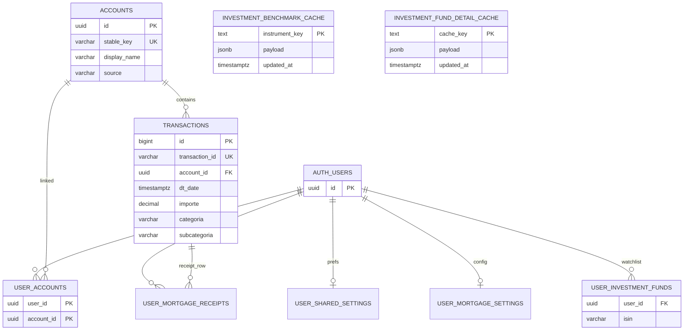
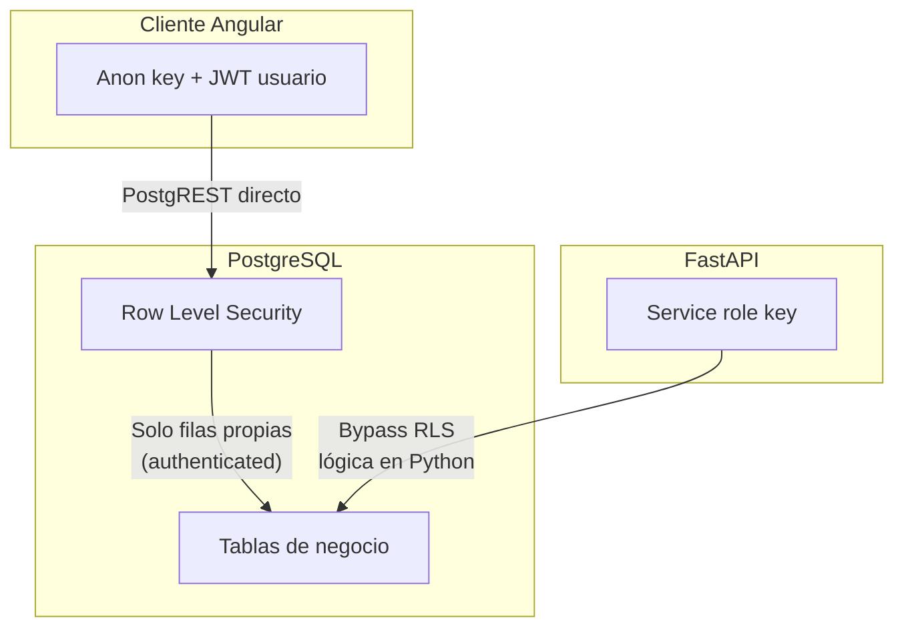
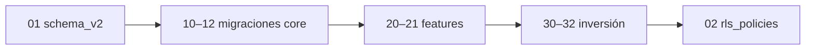

# Supabase — Esquema y migraciones

Fuente de verdad del modelo de datos PostgreSQL de BankaAppTracker. Los scripts se ejecutan manualmente en **Supabase → SQL Editor** (no hay migrador automático en CI).

**Relacionado:** [Backend](../README.md) · [Arquitectura (diagramas)](../../docs/ARCHITECTURE.md) · [README raíz](../../README.md)

---

## Modelo de datos (vista lógica)



`AUTH_USERS` = tabla gestionada por Supabase Auth (`auth.users`). El backend referencia `user_id` como UUID de esa tabla.

---

## Política de acceso (RLS)



| Actor | Clave | Comportamiento |
|-------|-------|----------------|
| Frontend | Anon + JWT | Auth; no debe mutar tablas de negocio directamente |
| Backend | Service role | Lectura/escritura completa; validación JWT en API |
| RLS | Políticas en `02_rls_policies.sql` | Defensa si alguien llama a PostgREST con JWT |

---

## Inventario de scripts

```text
supabase/sql/
├── 01_schema_v2.sql              # Base: accounts, user_accounts, transactions
├── 02_rls_policies.sql           # Políticas RLS (ejecutar tras tablas)
├── migrations/
│   ├── 10_user_accounts.sql
│   ├── 11_add_account_id.sql
│   ├── 12_dt_date_timestamptz.sql
│   ├── 20_user_shared_settings.sql
│   ├── 21_mortgage_settings.sql
│   ├── 30_user_investment_funds.sql
│   ├── 31_investment_benchmark_series_cache.sql
│   └── 32_investment_fund_detail_cache.sql
├── maintenance/
│   └── truncate_benchmark_cache.sql
└── legacy/                       # No usar en instalaciones nuevas
    ├── schema_v1.sql
    └── schema_multiuser.sql
```

---

## Orden de ejecución

### Instalación nueva (greenfield)

Ejecutar en este orden. Si un script falla por objeto ya existente, revisar si esa migración ya se aplicó antes de forzar.

| Paso | Archivo | Resultado |
|:----:|---------|-----------|
| 1 | `01_schema_v2.sql` | Núcleo transaccional |
| 2 | `migrations/10_user_accounts.sql` | Solo si migras desde esquema antiguo sin v2 completo |
| 3 | `migrations/11_add_account_id.sql` | Columna `account_id` en `transactions` |
| 4 | `migrations/12_dt_date_timestamptz.sql` | `dt_date` → `TIMESTAMPTZ` |
| 5 | `migrations/20_user_shared_settings.sql` | Gastos compartidos |
| 6 | `migrations/21_mortgage_settings.sql` | Hipoteca usuario |
| 7 | `migrations/30_user_investment_funds.sql` | Watchlist ISIN |
| 8 | `migrations/31_investment_benchmark_series_cache.sql` | Caché series inversión |
| 9 | `migrations/32_investment_fund_detail_cache.sql` | Caché fichas fondo |
| 10 | `02_rls_policies.sql` | Políticas RLS |



### Ya tienes `01_schema_v2` aplicado

Ejecuta solo migraciones **pendientes** (11–32 y RLS si faltan). No repitas `01` salvo entorno de prueba con `DROP` documentado en el propio script.

---

## Tablas por dominio

### Núcleo bancario

| Tabla | Clave natural | Uso en app |
|-------|---------------|------------|
| `accounts` | `stable_key` (`ibercaja_716552`, `revolut`) | Identidad de cuenta bancaria |
| `user_accounts` | `(user_id, account_id)` | Qué cuentas ve cada usuario |
| `transactions` | `transaction_id` | Movimientos importados y editados |

Índices principales: `account_id`, `dt_date DESC` (ver `01_schema_v2.sql`).

### Funcionalidades extendidas

| Tabla | Migración | Backend / UI |
|-------|-----------|--------------|
| `user_shared_settings` | 20 | `/gastos-compartidos` |
| `user_mortgage_settings` | 21 | `/hipotecas` |
| `user_mortgage_receipts` | 21 | Confirmación recibos hipoteca |
| `user_investment_funds` | 30 | Watchlist `/inversion` |
| `investment_benchmark_series_cache` | 31 | Gráfico benchmarks (global, por `instrument_key`) |
| `investment_fund_detail_cache` | 32 | Modal ficha fondo |

### Caché de inversión (`31`)

| Columna | Tipo | Descripción |
|---------|------|-------------|
| `instrument_key` | TEXT PK | ISIN (12) o `CRYPTO:BTC-USD` |
| `yahoo_symbol` | TEXT | Símbolo Yahoo usado en descarga |
| `payload` | JSONB | `nav_bars`, `name`, `clasificacion`, … |
| `updated_at` | TIMESTAMPTZ | **Referencia del refresco automático cada 8 h** |

El backend consulta `MAX(updated_at)` para decidir si vuelve a descargar yfinance ([`investment_benchmarks.py`](../app/api/services/investment_benchmarks.py)).

---

## Mantenimiento operativo

### Vaciar caché de benchmarks

1. SQL: `sql/maintenance/truncate_benchmark_cache.sql`
2. CLI:

```bash
cd Backend
venv\Scripts\python.exe scripts\rebuild_investment_benchmark_series_cache.py --full-rebuild
```

### Legacy

| Archivo | Estado |
|---------|--------|
| `legacy/schema_v1.sql` | Histórico |
| `legacy/schema_multiuser.sql` | Histórico |

Conservados solo como referencia arqueológica; **no** forman parte del camino de instalación actual.

---

## Trazabilidad SQL → código backend

| Tabla | Métodos principales (`supabase_service`) |
|-------|------------------------------------------|
| `transactions` | Inserción batch import, filtros por cuenta/usuario |
| `accounts` / `user_accounts` | Resolución cuenta en upload, listados |
| `user_investment_funds` | `list_user_investment_funds`, `add_user_investment_fund` |
| `investment_benchmark_series_cache` | `get_investment_benchmark_series_batch`, `upsert_investment_benchmark_series` |
| `investment_fund_detail_cache` | Lectura/escritura ficha (ver `investment_fund_detail.py`) |

---

## Checklist nuevo entorno Supabase

- [ ] Proyecto creado en Supabase
- [ ] Scripts 01 → migraciones → 02 ejecutados sin error
- [ ] Auth: email/password o proveedor configurado
- [ ] `SUPABASE_URL`, `SUPABASE_ANON_KEY`, `SUPABASE_SERVICE_ROLE_KEY` copiados a `Backend/.env` y Render
- [ ] Primera importación de extracto o refresco benchmarks para poblar caché inversión
