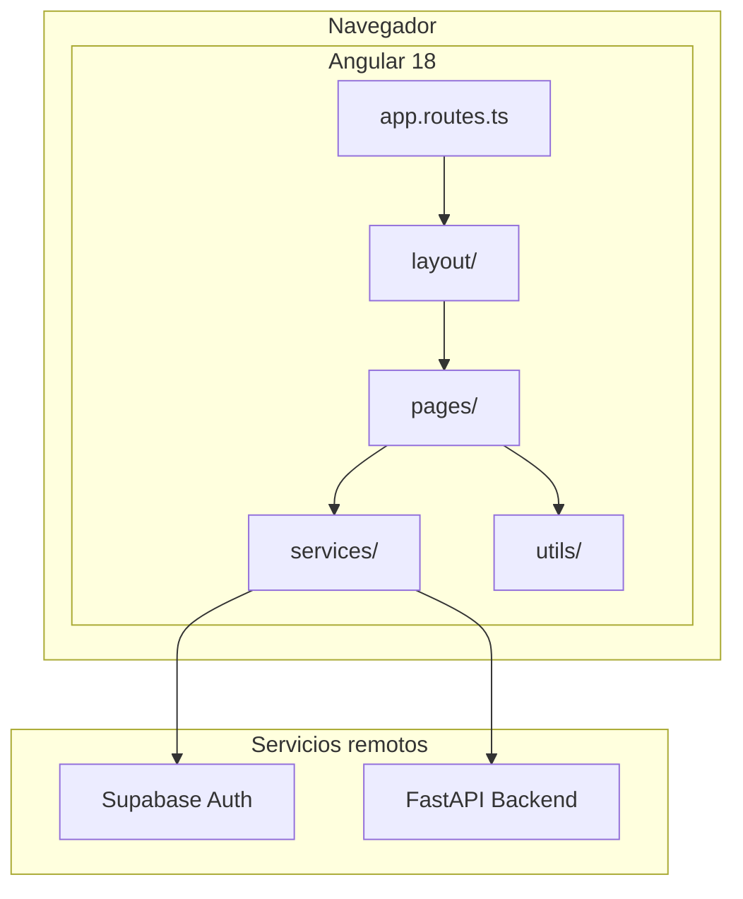
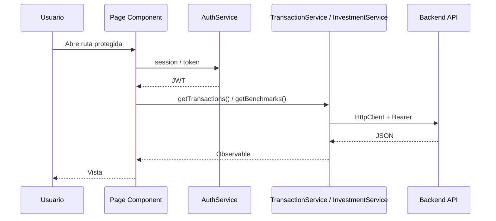
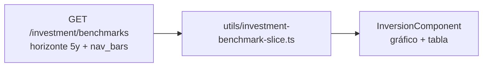

# Frontend — Angular

SPA de BankaAppTracker (`Frontend/banka-app`). Componentes standalone, autenticación Supabase y consumo de la API FastAPI con JWT en cada petición.

**Relacionado:** [README raíz](../README.md) · [Backend](../Backend/README.md)

---

## Arquitectura frontend



### Flujo de autenticación y datos



---

## Estructura del proyecto

```text
Frontend/banka-app/
├── src/
│   ├── app/
│   │   ├── app.routes.ts           # Rutas y lazy loading
│   │   ├── layout/                 # Shell, navegación, toasts
│   │   ├── pages/
│   │   │   ├── gastos/             # Movimientos (default)
│   │   │   ├── resumen/            # KPIs y categorías
│   │   │   ├── charts/             # Analítica temporal
│   │   │   ├── shared-expenses/    # Gastos compartidos
│   │   │   ├── inversion/          # Benchmarks y fondos
│   │   │   ├── hipotecas/          # Amortización y simulaciones
│   │   │   ├── ajustes/            # Cuentas, tema, mantenimiento
│   │   │   ├── login/ · register/
│   │   ├── services/               # HTTP + Supabase
│   │   └── utils/                  # p. ej. investment-benchmark-slice
│   ├── environment.ts              # Dev
│   ├── environment.prod.ts         # Producción
│   └── styles.scss                 # Variables CSS y tema
├── scripts/download-all-icons.js
├── angular.json
└── package.json
```

---

## Rutas y responsabilidades

Definición: `src/app/app.routes.ts`.

| Ruta | Componente | Función |
|------|------------|---------|
| `/login` | `LoginComponent` | Inicio sesión |
| `/register` | `RegisterComponent` | Registro |
| `/gastos` | `GastosComponent` | Lista movimientos, filtros, saldos (**inicio por defecto**) |
| `/resumen` | `ResumenComponent` | Agregados por categoría / periodo |
| `/charts` | `ChartsComponent` | Gráficas gastos/ingresos y tendencias |
| `/gastos-compartidos` | `SharedExpensesComponent` | Cuentas vinculadas entre usuarios |
| `/inversion` | `InversionComponent` | Curvas %, tabla métricas, watchlist ISIN |
| `/hipotecas` | `HipotecasComponent` | Cuadro amortización y escenarios |
| `/ajustes` | `AjustesComponent` | Cuentas, privacidad, tema |
| `**` | — | Redirige a `/gastos` |

Rutas hijas viven bajo `LayoutComponent` (shell con menú).

---

## Servicios y trazabilidad API

| Servicio | Fichero | Backend (prefijo `/GET` o `/upload`) |
|----------|---------|--------------------------------------|
| `AuthService` | `auth.service.ts` | Supabase Auth (no FastAPI) |
| `TransactionService` | `transaction.service.ts` | `transactions`, `balances`, `accounts`, `category-catalog`, mortgage, shared |
| `InvestmentService` | `investment.service.ts` | `investment/benchmarks`, `funds`, `fund-detail` |
| `BackendLoaderService` | `backend-loader.service.ts` | Estados de carga global |
| `ThemeService` | `theme.service.ts` | Tema claro/oscuro (metadata + local) |
| `PrivacyService` | `privacy.service.ts` | Ocultar importes en UI |

Catálogo completo de endpoints: [`Backend/README.md`](../Backend/README.md#catálogo-de-api).

---

## Inversión en el cliente



- El **periodo** (YTD, 1m, 6m, …) se aplica **en memoria** sobre `nav_bars`; no se pide otra ventana al servidor.
- Errores por ISIN sin caché: array `errors` en la respuesta; la UI lista ISIN pendientes de refresco backend.
- Ficha ampliada: `GET /investment/fund-detail?isin=` o `?symbol=` (cripto).

---

## Configuración de entorno

| Fichero | Uso |
|---------|-----|
| `src/environment.ts` | Desarrollo local |
| `src/environment.prod.ts` | Build producción (Vercel) |

| Propiedad | Desarrollo típico | Producción |
|-----------|-------------------|------------|
| `apiUrl` | `http://localhost:8000` | `https://bankaapptracker.onrender.com` |
| `supabaseUrl` | URL proyecto Supabase | Igual |
| `supabaseAnonKey` | Anon key | Igual |

El backend debe listar el origen del frontend en `CORS_ORIGINS`.

---

## Theming y UX

- Variables globales en `src/styles.scss` (colores, espaciado).
- Modo oscuro: clase `theme-dark` en raíz; `ThemeService` persiste preferencia.
- Iconos categoría/marca: script `npm run icons` → assets locales.

---

## Scripts npm

Ejecutar desde `Frontend/banka-app`:

| Comando | Acción |
|---------|--------|
| `npm install` | Dependencias |
| `npm start` | `ng serve` → http://localhost:4200 |
| `npm run build` | Build producción |
| `npm run watch` | Build en watch |
| `npm test` | Tests Karma/Jasmine |
| `npm run icons` | Descarga set de iconos |

---

## Desarrollo local (orden recomendado)

1. Backend en `http://localhost:8000` con Supabase configurado ([`Backend/README.md`](../Backend/README.md)).
2. `environment.ts` con `apiUrl` local y claves Supabase.
3. `npm start` en `Frontend/banka-app`.
4. Usuario de prueba en Supabase Auth o registro desde `/register`.

---

## Build y despliegue (Vercel)

| Parámetro | Valor |
|-----------|--------|
| Root directory | `Frontend/banka-app` |
| Build command | `npm run build` |
| Output | `dist/banka-app/browser` (verificar en `angular.json` según versión CLI) |

Variables en Vercel: no suelen ser necesarias si `environment.prod.ts` está commiteado con URLs de prod; para previews, valorar `environment.ts` por entorno o sustitución en build.

---

## Trazabilidad página → dependencias

| Página | Servicios / utils clave |
|--------|-------------------------|
| Gastos / Resumen | `TransactionService` |
| Charts | `TransactionService` (agregaciones cliente) |
| Shared expenses | `TransactionService` |
| Inversión | `InvestmentService`, `investment-benchmark-slice` |
| Hipotecas | `TransactionService` (mortgage endpoints) + lógica local amortización |
| Ajustes | `TransactionService`, `ThemeService`, `PrivacyService` |

---

## Calidad y convenciones

- **Standalone components** — sin NgModules.
- **Lazy loading** — todas las páginas principales vía `loadComponent`.
- **SCSS por componente** — estilos encapsulados; tokens globales en `styles.scss`.
- Nuevas pantallas: añadir ruta en `app.routes.ts`, servicio HTTP si aplica, documentar fila en este README y endpoint en Backend.
