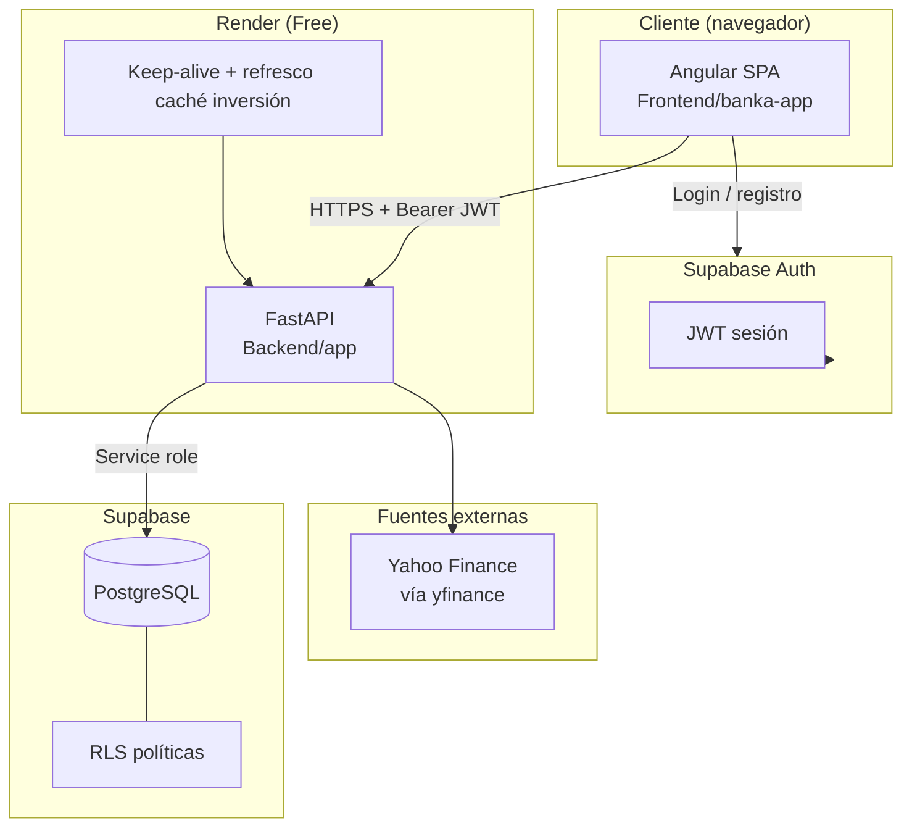
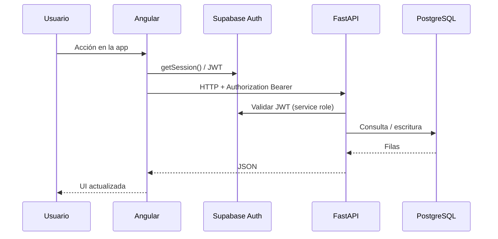

# BankaAppTracker

Aplicación web de finanzas personales: centraliza extractos bancarios, analiza gastos, compara fondos de inversión y simula estrategias hipotecarias.

---

## Mapa de documentación

| Documento | Audiencia | Contenido |
|-----------|-----------|-----------|
| **Este archivo** | Producto / onboarding | Visión, capacidades, arquitectura global |
| [**docs/ARCHITECTURE.md**](docs/ARCHITECTURE.md) | Arquitectura | Diagramas C4, flujos E2E, matriz trazabilidad |
| [`docs/README.md`](docs/README.md) | Índice | Carpeta `docs/` y capturas |
| [`Backend/README.md`](Backend/README.md) | Backend | API, servicios, procesos en background, despliegue |
| [`Backend/supabase/README.md`](Backend/supabase/README.md) | Datos | Esquema PostgreSQL, migraciones, RLS |
| [`Frontend/README.md`](Frontend/README.md) | Frontend | Angular, rutas, servicios, build Vercel |

---

## Arquitectura del sistema



### Flujo de una petición autenticada



---

## Repositorio

```text
BankaAppTracker/
├── README.md                 ← Este documento
├── render.yaml               ← Deploy backend (Render)
├── Backend/                  ← API Python
│   ├── app/
│   ├── scripts/
│   └── supabase/sql/         ← Migraciones SQL
└── Frontend/
    └── banka-app/            ← SPA Angular 18
```

---

## Capacidades y trazabilidad

| Área funcional | Ruta UI | API principal | Tablas / caché |
|----------------|---------|---------------|----------------|
| Movimientos y saldos | `/gastos`, `/resumen` | `GET /GET/transactions`, `GET /GET/balances` | `transactions`, `accounts` |
| Analítica | `/charts` | `GET /GET/transactions` (filtros fecha) | `transactions` |
| Gastos compartidos | `/gastos-compartidos` | `GET /GET/shared-transactions` | `user_shared_settings` |
| Inversión | `/inversion` | `GET /GET/investment/benchmarks` | `investment_benchmark_series_cache`, `user_investment_funds` |
| Pagos recurrentes | `/pagos-recurrentes` | `GET/PATCH /GET/recurring-payments` | `transactions`, `user_recurring_payment_dismissed` |
| Hipotecas | `/hipotecas` | `GET/PATCH /GET/mortgage*` | `user_mortgage_settings`, `user_mortgage_receipts` |
| Importar extracto | (upload en app) | `POST /upload/Transactions` | `transactions`, `accounts` |
| Ajustes | `/ajustes` | `GET/PATCH /GET/accounts`, categorías | `accounts`, metadata usuario |

Detalle de endpoints: [`Backend/README.md`](Backend/README.md#catálogo-de-api).

---

## Stack y despliegue

| Capa | Tecnología | Hosting |
|------|------------|---------|
| Frontend | Angular 18, SCSS, RxJS | [Vercel](https://vercel.com) — root `Frontend/banka-app` |
| Backend | FastAPI, pandas, yfinance | [Render](https://render.com) — ver `render.yaml` |
| Auth + BD | Supabase (Auth + PostgreSQL) | Proyecto Supabase |

URLs de producción habituales:

- Frontend: `https://banka-app-tracker.vercel.app`
- Backend: `https://bankaapptracker.onrender.com`

---

## Inicio rápido (desarrollo)

### 1. Base de datos

Aplicar scripts en orden: [`Backend/supabase/README.md`](Backend/supabase/README.md).

### 2. Backend

```bash
cd Backend
python -m venv venv
venv\Scripts\activate          # Windows
pip install -r requirements.txt
copy .env.example .env         # Rellenar SUPABASE_*
uvicorn app.main:app --reload
```

→ `http://localhost:8000` — OpenAPI: `/docs`

### 3. Frontend

```bash
cd Frontend/banka-app
npm install
npm start
```

→ `http://localhost:4200` — `environment.ts` debe apuntar `apiUrl` a `http://localhost:8000`.

---

## Inversión: actualización de datos

No se usa cron de pago en Render. El backend refresca la caché de fondos:

1. Al **arrancar** la instancia (despertar tras inactividad).
2. En cada ciclo de **keep-alive** (si `APP_URL` está configurada).
3. Solo si en Supabase pasaron ≥ **8 horas** desde el último `updated_at` global de la caché.

Diagrama y variables: [`Backend/README.md`](Backend/README.md#procesos-en-background).

---

## Seguridad (resumen)

- El cliente nunca usa la **service role key** de Supabase; solo anon key + JWT.
- El backend valida JWT en cada ruta protegida (`get_current_user`).
- RLS en PostgreSQL limita acceso directo PostgREST; el backend escribe con service role de forma controlada.
- CORS restringido a orígenes explícitos (`CORS_ORIGINS`).

---

## Capturas de producto

Guarda PNG/WebP en [`docs/screenshots/`](docs/screenshots/) (`gastos.png`, `resumen.png`, `charts.png`, `inversion.png`, `hipotecas.png`) y enlázalas aquí cuando las tengas.

Diagramas técnicos: [**docs/ARCHITECTURE.md**](docs/ARCHITECTURE.md).

## Contribuir / ampliar docs

- Nuevas pantallas: actualizar [`Frontend/README.md`](Frontend/README.md) y fila en [`docs/ARCHITECTURE.md`](docs/ARCHITECTURE.md#10-matriz-de-trazabilidad-completa).
- Cambios de esquema: migración en `Backend/supabase/sql/migrations/` + [`Backend/supabase/README.md`](Backend/supabase/README.md).
