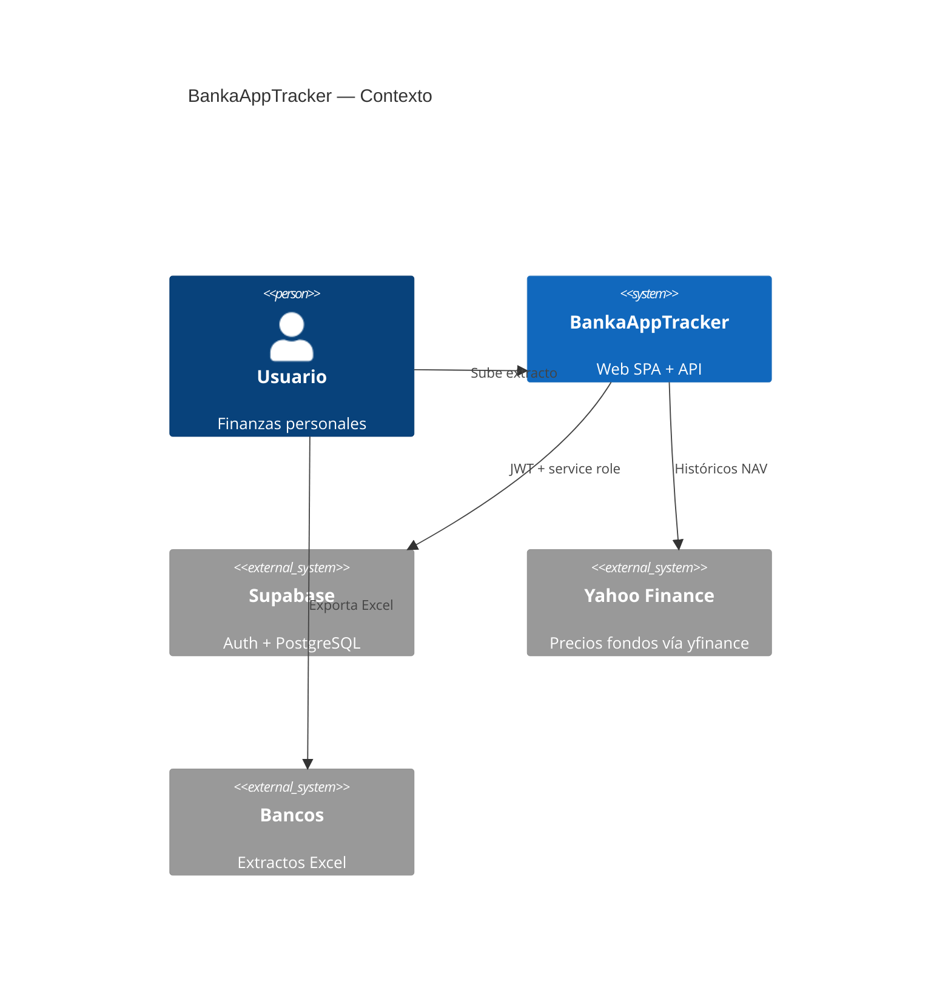
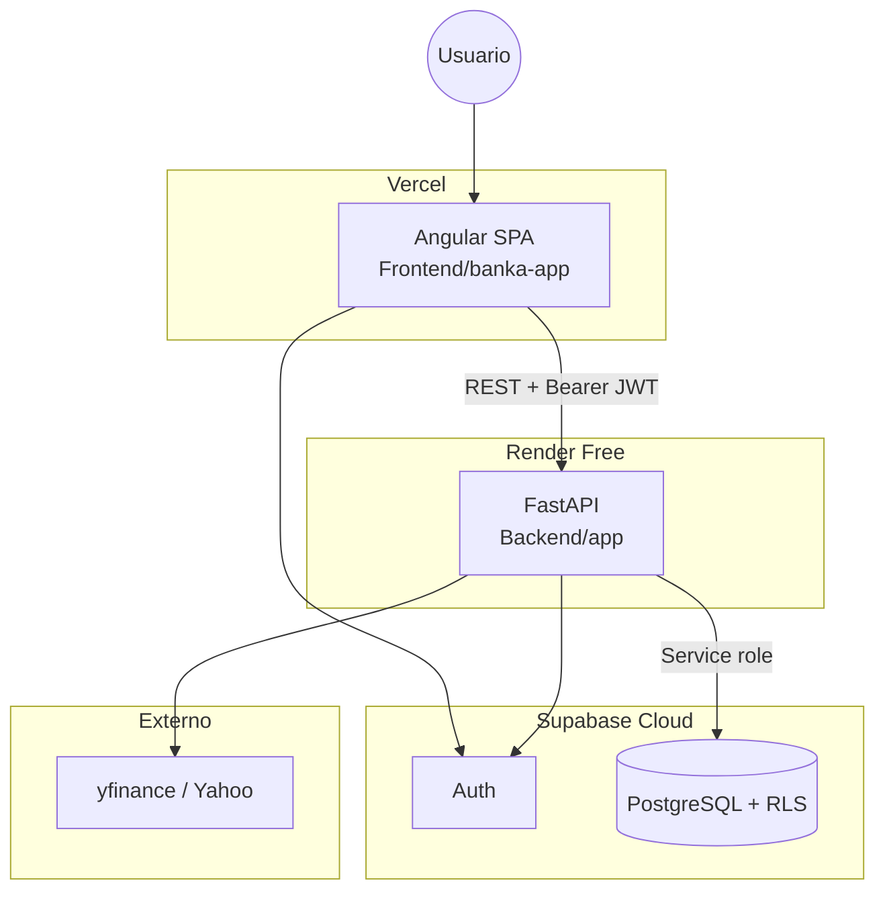
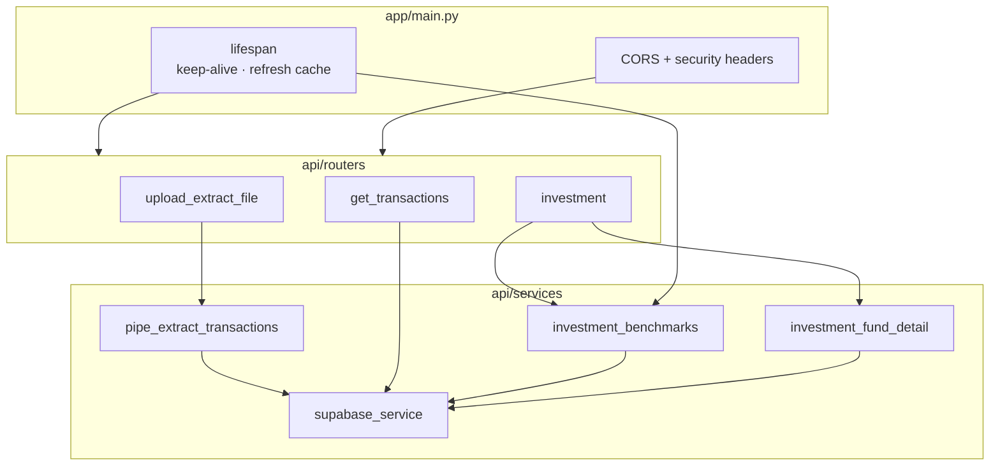
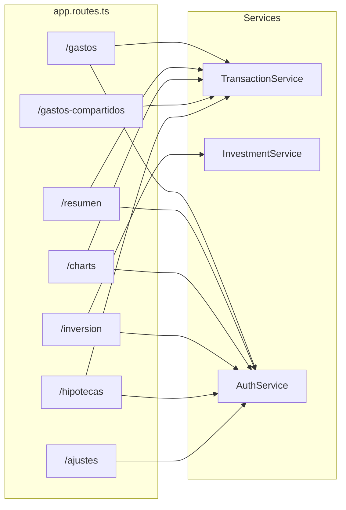
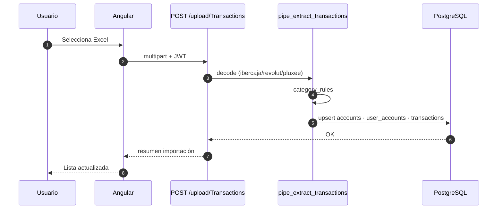
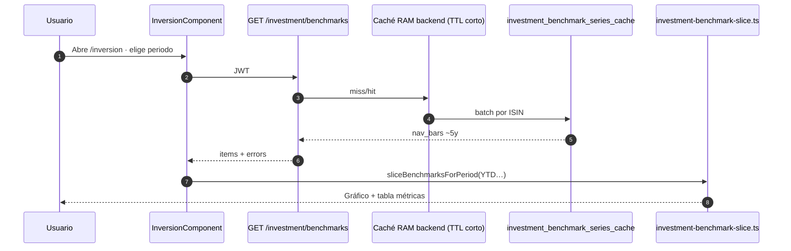
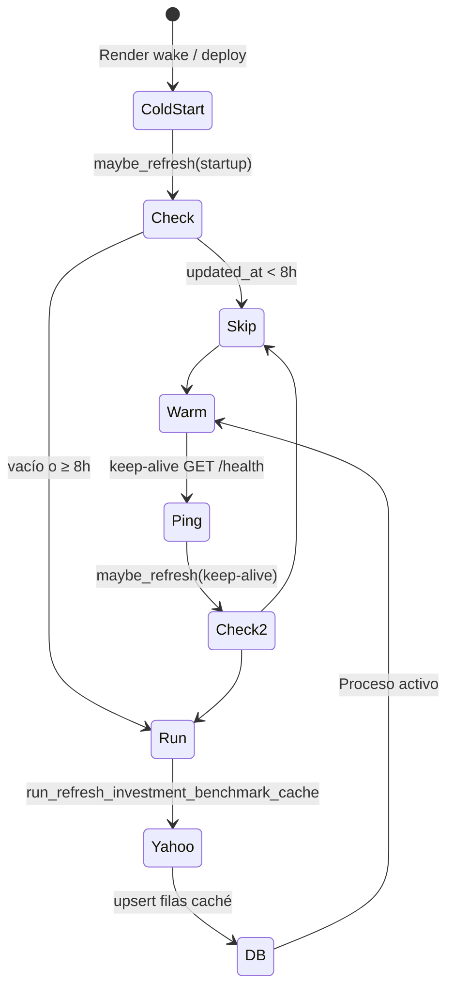
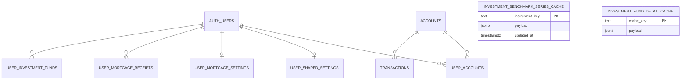
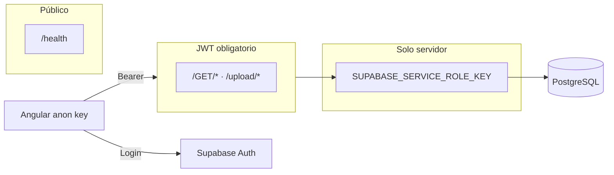
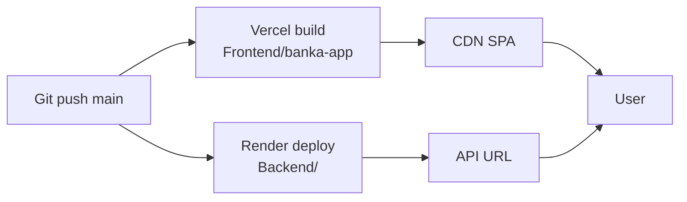

# Arquitectura — BankaAppTracker

Documento de referencia visual y trazabilidad end-to-end. Para detalle operativo por capa, ver los README enlazados al final.

---

## 1. Contexto del sistema (C4 — nivel 1)

---

## 2. Contenedores (despliegue)

| Contenedor | Repo | URL prod (habitual) |
|------------|------|---------------------|
| SPA | `Frontend/banka-app` | `https://banka-app-tracker.vercel.app` |
| API | `Backend/` | `https://bankaapptracker.onrender.com` |
| Datos | `Backend/supabase/sql/` | Panel Supabase |

---

## 3. Módulos backend

---

## 4. Módulos frontend

---

## 5. Flujo de datos — importación extracto

**Tablas tocadas:** `accounts`, `user_accounts`, `transactions`.

---

## 6. Flujo de datos — inversión (lectura)

**Tablas:** `user_investment_funds`, `investment_benchmark_series_cache` (global por `instrument_key`).

---

## 7. Refresco automático caché inversión

| Disparador | Código |
|------------|--------|
| Arranque | `main.py` → `_benchmark_refresh_on_startup()` |
| Keep-alive | `_keep_alive_loop()` tras HTTP 200 |
| Decisión 8 h | `should_refresh_investment_benchmark_cache()` |
| Ejecución | `run_refresh_investment_benchmark_cache()` |

Variables: `INVESTMENT_BENCHMARK_REFRESH_INTERVAL_HOURS`, `INVESTMENT_BENCHMARK_REFRESH_IN_APP`.

---

## 8. Modelo de datos (resumen ER)

Scripts y orden: [`Backend/supabase/README.md`](../Backend/supabase/README.md).

---

## 9. Seguridad y confianza

| Superficie | Protección |
|------------|------------|
| API REST | `HTTPBearer` + `get_current_user` |
| PostgREST directo | RLS `authenticated` |
| Escritura masiva | Solo backend con service role |
| CORS | Lista blanca `CORS_ORIGINS` |

---

## 10. Matriz de trazabilidad completa

| # | Capacidad | UI | Servicio FE | Endpoint | Servicio BE | Tabla / caché |
|---|-----------|-----|-------------|----------|-------------|---------------|
| 1 | Login | `/login` | AuthService | Supabase Auth | — | `auth.users` |
| 2 | Listar movimientos | `/gastos` | TransactionService | `GET /GET/transactions` | supabase_service | `transactions` |
| 3 | Saldos | `/gastos`, `/resumen` | TransactionService | `GET /GET/balances` | supabase_service | `transactions` |
| 4 | Importar Excel | upload UI | TransactionService | `POST /upload/Transactions` | pipe_extract | `transactions`, `accounts` |
| 5 | Editar categoría | modales | TransactionService | `PATCH .../category` | supabase_service | `transactions` |
| 6 | Charts analítica | `/charts` | TransactionService | `GET /GET/transactions` | supabase_service | `transactions` |
| 7 | Gastos compartidos | `/gastos-compartidos` | TransactionService | `GET /GET/shared-transactions` | supabase_service | + settings |
| 8 | Benchmarks | `/inversion` | InvestmentService | `GET /GET/investment/benchmarks` | investment_benchmarks | `investment_benchmark_series_cache` |
| 9 | Watchlist ISIN | `/inversion` | InvestmentService | `GET/POST/DELETE .../funds` | investment_* | `user_investment_funds` |
| 10 | Ficha fondo | modal | InvestmentService | `GET .../fund-detail` | investment_fund_detail | `investment_fund_detail_cache` |
| 11 | Hipoteca | `/hipotecas` | TransactionService | `GET/PATCH /GET/mortgage*` | supabase_service | `user_mortgage_*` |
| 12 | Renombrar cuenta | `/ajustes` | TransactionService | `PATCH /GET/accounts/{id}` | supabase_service | `accounts` |

---

## 11. Pipeline CI/CD (conceptual)

| Rama | Frontend | Backend |
|------|----------|---------|
| `main` | Auto-deploy Vercel | Auto-deploy Render (`render.yaml`) |

---

## 12. Capturas de producto

Carpeta reservada: [`screenshots/`](screenshots/). Añadir PNG/WebP y referenciar desde el [README raíz](../README.md#capturas-de-producto).

Sugerencia de nombres:

| Archivo | Pantalla |
|---------|----------|
| `gastos.png` | Lista movimientos |
| `resumen.png` | KPIs categorías |
| `charts.png` | Analítica temporal |
| `inversion.png` | Gráfico benchmarks |
| `hipotecas.png` | Simulación hipoteca |

---

## Documentación relacionada

| Documento | Uso |
|-----------|-----|
| [README raíz](../README.md) | Producto e inicio rápido |
| [Backend/README.md](../Backend/README.md) | API, env, background jobs |
| [Backend/supabase/README.md](../Backend/supabase/README.md) | SQL, migraciones, RLS |
| [Frontend/README.md](../Frontend/README.md) | Angular, rutas, build |
| [docs/README.md](README.md) | Índice de esta carpeta |
